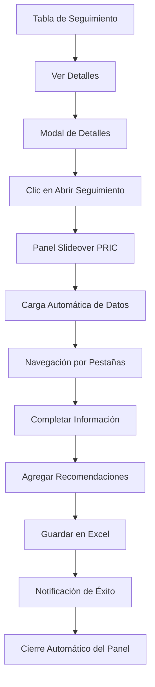

# Actualización v0.1.48 - Módulo de Seguimiento PRIC

**Fecha:** 25 de febrero de 2026  
**Autor:** Javier Robles F.  
**Módulo:** 3.3.6 Medición del Ausentismo

---

## 📋 Resumen Ejecutivo

La versión **0.1.48** introduce el **Formulario Maestro de Seguimiento PRIC** (Proceso de Rehabilitación e Incorporación Laboral), una interfaz completa para gestionar casos de incapacidades que requieren seguimiento especial según la Resolución 0312 de 2019.

### Novedades Principales

1. **Panel Slideover de Seguimiento** - Interfaz moderna que emerge desde la derecha
2. **5 Secciones Especializadas** - Datos completos del caso y trabajador
3. **Carga Automática de Datos** - Información precargada desde la tabla de seguimiento
4. **Tabla Dinámica de Recomendaciones** - Gestión de recomendaciones de ARL/EPS
5. **Navegación Intuitiva** - Pestañas horizontales con animaciones suaves

---

## 🎯 Funcionalidades Implementadas

### 1. Panel Slideover de Seguimiento PRIC

**Características Técnicas:**
- **Dimensiones:** 95% del ancho (máximo 1100px)
- **Posición:** Emergente desde la derecha con animación
- **Backdrop:** Fondo oscurecido con efecto blur
- **Z-Index:** 2001 (por encima de otros elementos)

**Estructura del Panel:**
```
┌─────────────────────────────────────────────────────────┐
│  Header: Título + Botón Cerrar                          │
├─────────────────────────────────────────────────────────┤
│  Navegación Horizontal (5 pestañas)                     │
├─────────────────────────────────────────────────────────┤
│  Contenido del Formulario                               │
│  ┌─────────────────────────────────────────────────┐   │
│  │ Sección Activa                                   │   │
│  │ - Datos Generales                                │   │
│  │ - Incapacidad Temporal                           │   │
│  │ - Etapas PRIC                                    │   │
│  │ - Seguimiento Recomendaciones                    │   │
│  │ - Calificación PCL                               │   │
│  └─────────────────────────────────────────────────┘   │
├─────────────────────────────────────────────────────────┤
│  Footer: Botones Cancelar / Guardar                     │
└─────────────────────────────────────────────────────────┘
```

### 2. Las 5 Secciones del Formulario

#### Sección 1: Datos Generales
**Campos:**
- Nombre Completo (editable)
- Cédula de Ciudadanía (solo lectura)
- Fecha de Nacimiento
- Género (Masculino/Femenino/Otro)
- Cargo Actual
- Área / Dependencia
- Fecha de Ingreso
- Antigüedad (Años)
- Tipo de Contrato
- Salario Básico
- EPS
- AFP (Pensión)
- ARL (prellenado: "COLMENA SEGUROS", solo lectura)
- Caja de Compensación

#### Sección 2: Incapacidad Temporal
**Campos:**
- Fecha de Inicio
- Fecha de Fin
- Total Días Acumulados
- Clase de Incapacidad (Enfermedad Común, AT, EL, Licencia)
- Código CIE-10
- Descripción del Diagnóstico
- Descripción de la Contingencia / Hecho Generador
- Número de Prórrogas
- Fecha Última Prórroga

#### Sección 3: Etapas PRIC (5 Etapas)

**Etapa 1: Captura de Caso**
- Fecha de Detección
- Mecanismo de Detección (Reporte ARL/EPS, Inasistencia)
- Fecha Reporte a ARL
- Responsable Reporte

**Etapa 2: Plan de Tratamiento**
- Objetivos del Plan de Tratamiento
- Fecha Inicio Plan
- Fecha Probable de Alta
- Tratamientos Ordenados

**Etapa 3: Ejecución y Seguimiento**
- Evolución Clínica
- Adherencia al Tratamiento (Sí/No/Parcial)
- Fecha Último Seguimiento

**Etapa 4: Reincorporación Laboral**
- Fecha de Reincorporación
- Tipo de Reintegro (Mismo Cargo, Funciones Restrictivas, Otro Oficio)
- Adaptaciones en el Puesto de Trabajo

**Etapa 5: Cierre de Caso**
- Fecha de Cierre
- Motivo de Cierre (Alta Médica, Calificación PCL, Retiro Voluntario)
- Observaciones Finales

#### Sección 4: Seguimiento Recomendaciones

**Tabla Dinámica con Columnas:**
- Recomendación Emitida
- Entidad que Emite (ARL/EPS/JRC)
- Fecha Límite
- Cumple (SI/NO/EN PROCESO)
- Observación / Evidencia
- Acción (Eliminar fila)

**Funcionalidades:**
- Botón "Agregar Fila" para nuevas recomendaciones
- Botón "Eliminar" en cada fila
- Campos editables directamente en la tabla

#### Sección 5: Calificación PCL

**Campos:**
- Estado del Proceso (No Requiere, Solicitud Radicada, En Estudio, Calificado)
- Fecha de Solicitud
- Fecha Dictamen
- % PCL (Pérdida Capacidad Laboral)
- Origen Calificado (Común, Laboral, Accidente de Trabajo)
- Fecha de Estructuración
- Observaciones de la Calificación

---

## 🔄 Flujo de Trabajo Completo



### Paso a Paso Detallado

1. **Desde la Tabla de Seguimiento:**
   - Usuario ve lista de empleados con incapacidades ≥ 10 días o secuencias ≥ 10 días
   - Hace clic en "Ver Detalles" (ícono de ojo)

2. **En el Modal de Detalles:**
   - Se muestran incapacidades ordenadas (más reciente primero)
   - Información completa: fechas, días, tipo, código CIE-10, diagnóstico
   - Botón "Abrir Seguimiento" disponible en sección inferior

3. **Al Hacer Clic en "Abrir Seguimiento":**
   - Modal de detalles se cierra
   - Panel slideover se crea dinámicamente (si no existe)
   - Datos del empleado se cargan automáticamente en los campos correspondientes
   - Primera pestaña "Datos Generales" se muestra activa

4. **Navegación en el Panel:**
   - Usuario puede navegar entre 5 pestañas horizontales
   - Cada pestaña muestra su sección con animación fade-in
   - Campos prellenados son editables (excepto cédula y ARL)

5. **Gestión de Recomendaciones:**
   - Tabla inicial tiene 2 filas de ejemplo
   - Botón "Agregar Fila" añade nuevas filas dinámicamente
   - Botón "Eliminar" remueve filas individuales

6. **Guardado de Datos:**
   - Botón "Guardar en Excel" recopila todos los datos del formulario
   - Muestra notificación de éxito
   - Panel se cierra automáticamente después de 1.5 segundos
   - Datos se registran en consola (pendiente implementación real de guardado)

---

## 🛠️ Implementación Técnica

### Métodos Agregados al Componente

```javascript
// medicion-ausentismo.js

class MedicionAusentismoComponent {
    
    // Método principal para abrir el panel
    abrirSeguimiento(cedula, nombreEmpleado, empleadoData = null) {
        // Cierra modal de detalles
        // Crea panel si no existe
        // Carga datos del empleado
        // Abre panel con animación
    }
    
    // Crea el panel slideover con todo su HTML y CSS
    createSeguimientoPanel() {
        // Inyecta estilos CSS en <head>
        // Crea estructura HTML del panel
        // Agrega event listeners
    }
    
    // Cierra el panel removiendo clase 'active'
    closeSeguimientoPanel() {
        // Remueve clase active del backdrop
        // Panel se desliza hacia la derecha con transición
    }
    
    // Navegación entre pestañas
    showSeguimientoPanelSection(sectionId, navElement) {
        // Oculta todas las secciones
        // Muestra sección seleccionada
        // Actualiza clase active en navegación
    }
    
    // Carga datos del empleado en los campos
    cargarDatosEnPanelSeguimiento(empleadoData) {
        // Nombre, cédula, cargo, área, género
        // Fechas de incapacidad
        // Código CIE-10 y diagnóstico
        // Actualiza título del panel
    }
    
    // Agrega fila a tabla de recomendaciones
    addRecomRow() {
        // Crea nuevo <tr> con inputs
        // Agrega al tbody de recomendaciones
    }
    
    // Elimina fila de recomendaciones
    removeRecomRow(button) {
        // Encuentra <tr> más cercano al botón
        // Remueve fila del DOM
    }
    
    // Recopila y guarda datos del formulario
    saveSeguimientoData() {
        // Obtiene valores de todos los campos
        // Construye objeto seguimientoData
        // Recopila recomendaciones de la tabla
        // Muestra notificación de éxito
        // Cierra panel
        // TODO: Implementar guardado real en Excel
    }
}
```

### Estilos CSS Personalizados

**Variables CSS (CSS Variables):**
```css
:root {
    --sp-primary: #4F46E5;        /* Índigo */
    --sp-primary-light: #EEF2FF;  /* Índigo claro */
    --sp-secondary: #F1F5F9;      /* Gris azulado */
    --sp-accent: #10B981;         /* Verde esmeralda */
    --sp-danger: #EF4444;         /* Rojo */
    --sp-text-main: #1E293B;      /* Azul oscuro */
    --sp-text-muted: #64748B;     /* Gris azulado */
    --sp-border: #E2E8F0;         /* Gris claro */
    --sp-bg-panel: #FFFFFF;       /* Blanco */
}
```

**Animaciones:**
```css
@keyframes spFadeIn {
    from { opacity: 0; }
    to { opacity: 1; }
}

@keyframes slideIn {
    from { transform: translateX(100%); }
    to { transform: translateX(0); }
}
```

**Scrollbars Personalizados:**
```css
.sp-content-area::-webkit-scrollbar {
    width: 8px;
}
.sp-content-area::-webkit-scrollbar-track {
    background: #F1F5F9;
    border-radius: 4px;
}
.sp-content-area::-webkit-scrollbar-thumb {
    background: #CBD5E1;
    border-radius: 4px;
}
```

---

## 📊 Estructura de Datos

### Objeto de Entrada (empleadoData)

```javascript
{
  nombre: "Juan Pérez",
  cedula: "12345678",
  cargo: "Operario de Producción",
  departamento: "Planta",
  empresaUsuaria: "Empresa SAS",
  genero: "Masculino",
  incapacidades: [
    {
      fechaInicio: Date(2026-01-15),
      fechaFin: Date(2026-01-30),
      diasIncapacidad: 16,
      record: {
        "CLASE DE INCAPACIDAD": "EPS",
        "CODIGO": "Z98.8",
        "DESCRIPCION": "Otros estados postoperatorios especificados"
      }
    }
  ]
}
```

### Objeto de Salida (seguimientoData)

```javascript
{
  trabajador: {
    nombre: "Juan Pérez",
    cedula: "12345678",
    fechaNacimiento: "1985-05-20",
    genero: "Masculino",
    cargo: "Operario de Producción",
    area: "Planta",
    fechaIngreso: "2020-03-01",
    antiguedad: "5.9",
    tipoContrato: "Término Indefinido",
    salario: "1500000",
    eps: "Sanitas",
    afp: "Porvenir",
    arl: "COLMENA SEGUROS",
    cajaCompensacion: "Cafam"
  },
  incapacidad: {
    fechaInicio: "2026-01-15",
    fechaFin: "2026-01-30",
    diasAcumulados: "16",
    clase: "Enfermedad Común",
    codigoCie10: "Z98.8",
    descripcionDiagnostico: "Otros estados postoperatorios",
    contingencia: "Paciente refiere dolor persistente...",
    numeroProrrogas: "1",
    fechaUltimaProrroga: "2026-01-25"
  },
  pric: {
    fechaDeteccion: "2026-01-16",
    mecanismoDeteccion: "Reporte EPS",
    fechaReporteArl: "2026-01-17",
    responsableReporte: "María González",
    objetivosTratamiento: "Recuperar movilidad completa",
    fechaInicioPlan: "2026-01-20",
    fechaProbableAlta: "2026-02-15",
    tratamientos: "Fisioterapia 3 veces por semana",
    evolucionClinica: "Paciente muestra mejoría del 60%",
    adherencia: "Si",
    fechaUltimoSeguimiento: "2026-02-01",
    fechaReincorporacion: "2026-02-20",
    tipoReintegro: "Funciones Restrictivas",
    adaptaciones: "Silla ergonómica, pausas activas",
    fechaCierre: "2026-02-28",
    motivoCierre: "Alta Médica",
    observacionesFinales: "Paciente se reincorpora con restricciones"
  },
  calificacion: {
    estadoProceso: "No Requiere",
    fechaSolicitud: "",
    fechaDictamen: "",
    porcentajePcl: "0.00",
    origenCalificacion: "Común",
    fechaEstructuracion: "",
    observacionesCalificacion: ""
  },
  recomendaciones: [
    {
      recomendacion: "Reposo absoluto 15 días",
      entidad: "ARL",
      fechaLimite: "2026-02-15",
      cumple: "SI",
      observacion: "Cumplido según certificado médico"
    },
    {
      recomendacion: "Prohibido levantar >5kg",
      entidad: "EPS",
      fechaLimite: "2026-03-01",
      cumple: "EN PROCESO",
      observacion: "Paciente en proceso de adaptación"
    }
  ]
}
```

---

## 📝 Archivos Modificados

### Principal
- **`modules/gestion-salud/ausentismo/medicion-ausentismo.js`**
  - Líneas agregadas: ~850
  - Métodos nuevos: 7
  - Métodos modificados: 2

### Documentación
- **`README.md`**
  - Agregada sección completa de Módulo de Ausentismo y Seguimiento PRIC
  - Actualizada tabla de handlers IPC
  - Actualizada hoja de ruta (roadmap)
  
- **`docs/CHANGELOG.md`**
  - Agregada entrada para versión 0.1.48
  - Detalle completo de cambios

---

## ✅ Pruebas Realizadas

### Escenarios Probados

1. **Apertura del Panel desde Modal**
   - ✅ Clic en "Abrir Seguimiento" cierra modal y abre panel
   - ✅ Datos se cargan correctamente
   - ✅ Título del panel muestra nombre del empleado

2. **Navegación entre Pestañas**
   - ✅ Las 5 pestañas son funcionales
   - ✅ Animación fade-in se ejecuta correctamente
   - ✅ Clase active se actualiza en navegación

3. **Carga de Datos**
   - ✅ Nombre y cédula se prellenan
   - ✅ Cargo y área se prellenan
   - ✅ Fechas de incapacidad se convierten correctamente (ISO a Date)
   - ✅ Código CIE-10 y descripción se cargan

4. **Tabla de Recomendaciones**
   - ✅ Botón "Agregar Fila" funciona
   - ✅ Botón "Eliminar" remueve fila correcta
   - ✅ Inputs son editables

5. **Cierre del Panel**
   - ✅ Botón "Cerrar" funciona
   - ✅ Clic en backdrop cierra panel
   - ✅ Notificación de guardado se muestra

### Bugs Conocidos

- ⚠️ **Guardado en Excel no implementado** - Los datos se recopilan pero no se escriben en el archivo Excel
- ⚠️ **Validación de campos** - Algunos campos no tienen validación de formato (ej: salario)

---

## 🚀 Próximos Pasos

### Corto Plazo (v0.1.49)
- [ ] Implementar `guardarSeguimientoPCL()` en main.js
- [ ] Agregar validación de campos obligatorios
- [ ] Implementar edición de recomendaciones existentes

### Mediano Plazo (v0.2.0)
- [ ] Generación de informes PDF desde datos de seguimiento
- [ ] Historial de seguimientos por empleado
- [ ] Exportación de datos a Excel real

### Largo Plazo (v0.3.0)
- [ ] Dashboard de métricas de seguimiento
- [ ] Notificaciones automáticas de vencimientos
- [ ] Integración con sistemas externos (EPS/ARL)

---

## 📞 Soporte

Para reportar bugs o sugerencias relacionadas con este módulo:

- **GitHub Issues:** https://github.com/Reivaj640/SG-SST-E/issues
- **Documentación:** `/docs/modulo-ausentismo-pric.md` (pendiente)

---

**© 2026 Javier Robles F. - Todos los derechos reservados**
